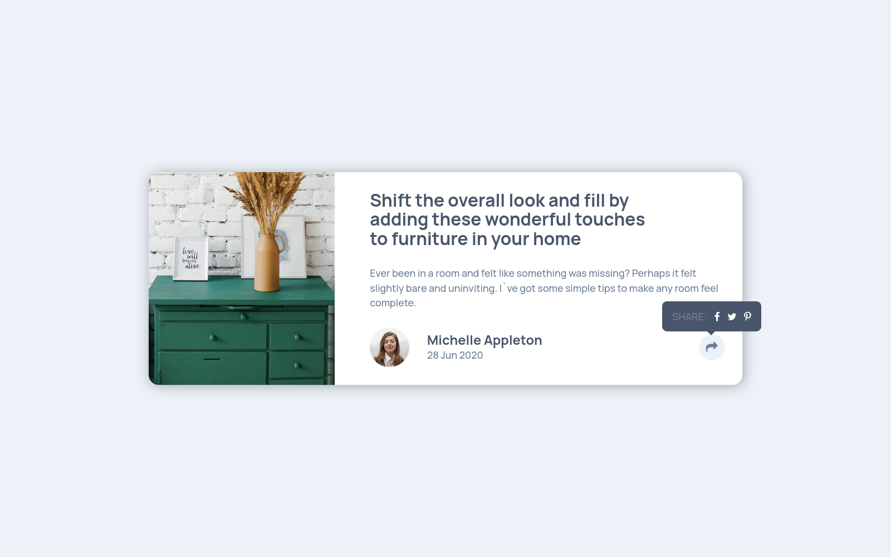

# Frontend Mentor - Article preview component solution

This is a solution to the [Article preview component challenge on Frontend Mentor](https://www.frontendmentor.io/challenges/article-preview-component-dYBN_pYFT). Frontend Mentor challenges help you improve your coding skills by building realistic projects.

## Table of contents

- [Frontend Mentor - Article preview component solution](#frontend-mentor---article-preview-component-solution)
  - [Table of contents](#table-of-contents)
  - [Overview](#overview)
    - [The challenge](#the-challenge)
    - [Screenshot](#screenshot)
    - [Links](#links)
  - [My process](#my-process)
    - [Built with](#built-with)
    - [What I learned](#what-i-learned)
  - [Author](#author)

**Note: Delete this note and update the table of contents based on what sections you keep.**

## Overview

### The challenge

Users should be able to:

- View the optimal layout for the component depending on their device's screen size
- See the social media share links when they click the share icon

### Screenshot

### Links

- Solution URL: [Here](https://github.com/tonmoysarker/fm-article-preview-component)
- Live Site URL: [Here](https://tonmoysarker.github.io/fm-article-preview-component/)

## My process

### Built with

- Semantic HTML5 markup
- CSS custom properties
- Flexbox
- CSS Grid
- CUBE CSS
- [React](https://react.dev/) - JS library

### What I learned

I have started learning React at the end of January 2025 and this was the first project I've done with react. I learned the simple basics.

## Author

- Frontend Mentor - [@tonmoysarker](https://www.frontendmentor.io/profile/tonmoysarker)
